# IRIDA Uploader Tutorial

## Table of Contents

[Uploading Data to a Project](#uploading-data-to-a-project)

[Uploading non-Illumina data](#uploading-non-illumina-data)

[Common Errors](#common-errors)

[Incorrectly formatted Sample Sheet](#incorrectly-formatted-sample-sheet)

[Missing or incorrectly named sample files](#missing-or-incorrectly-named-sample-files)

[Partially uploaded run](#partially-uploaded-run)

[More Errors](#more-errors)

## Uploading data to a project

#### Sign into IRIDA

For this tutorial, you will be provided credentials to sign into a test IRIDA platform.

Open Google Chrome and go to the provided URL to access IRIDA.

Use the IRIDA Username and Password given to sign in.

#### Create a new IRIDA project

Now that you are logged in, create a new project by selecting `Projects` > `Create New Project`.


Give your Project a name, and then select `Create Project`.

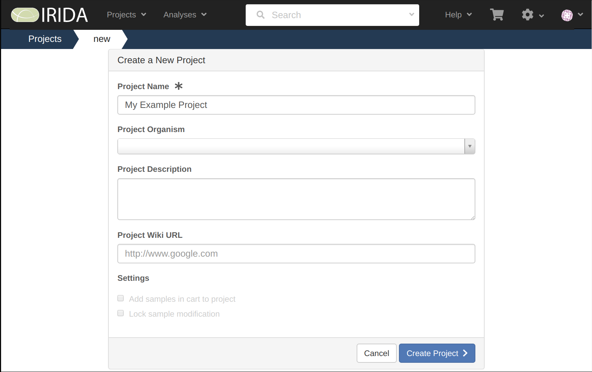

Make note of what your project number is, as it will be used later on when uploading your data.

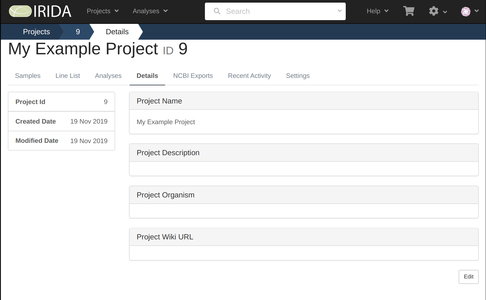

In our example above, the project number is 9

#### Download and install the IRIDA Uploader

Go to the releases page for the IRIDA Uploader and download the GUI installer for the latest release.

https://github.com/phac-nml/irida-uploader/releases


Once it's downloaded, launch the .exe file to open the installer.

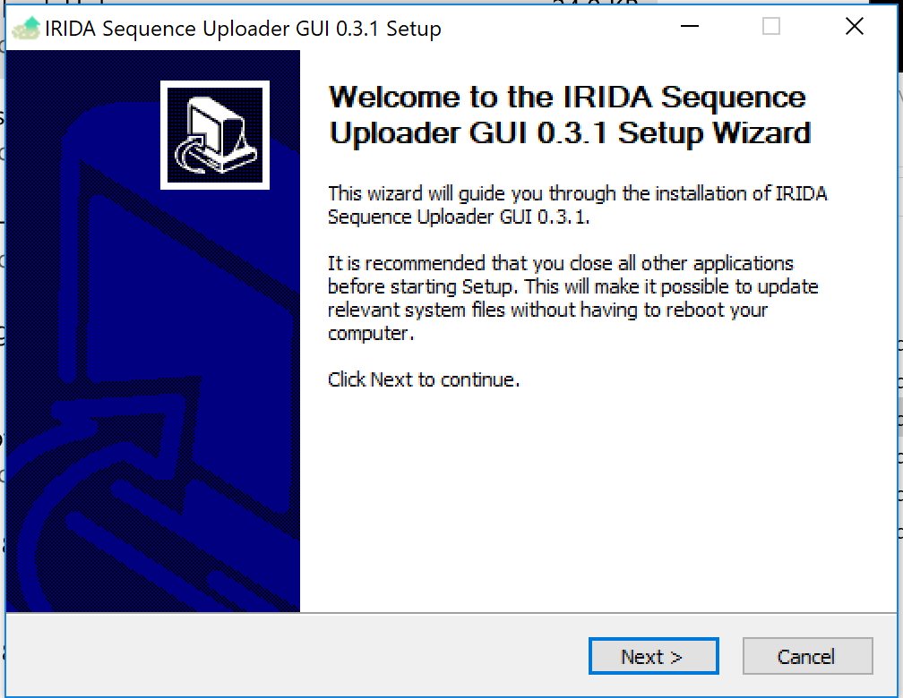

Click Next to continue.


Select Install just for me and click Next

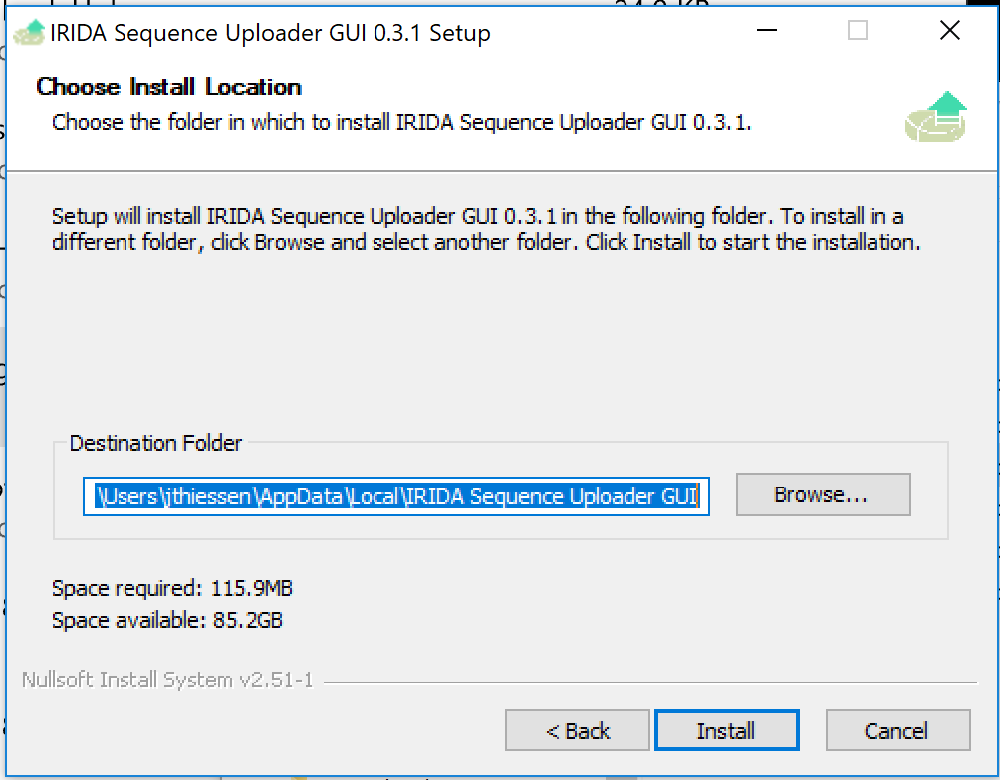

Leave the Destination as default and click Install

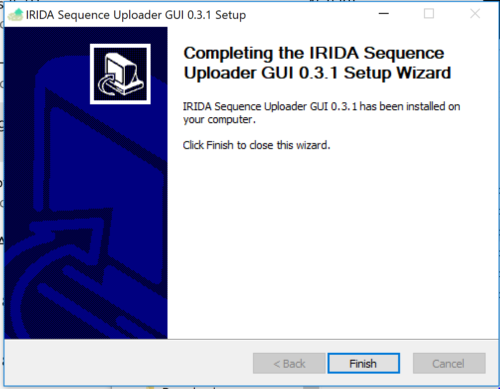

Click Finish to complete the installation

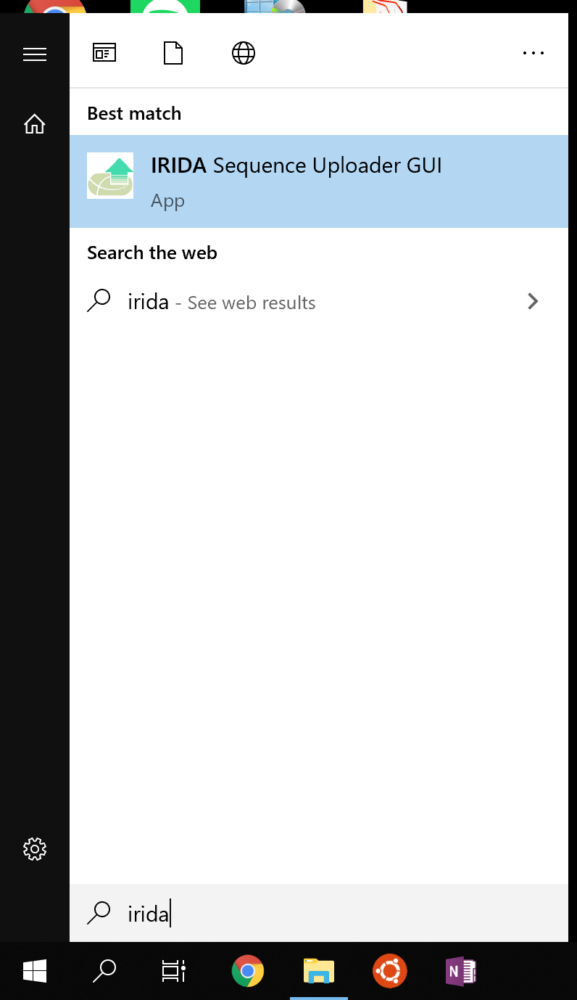

You can find the uploader by searching for IRIDA in the windows search bar

In some cases, the uploader will have trouble opening, so here is an alternative way to launch it.

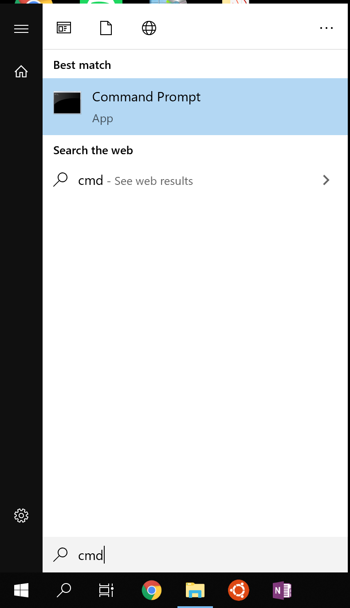

Search and open the applicaiton called `Command Prompt`

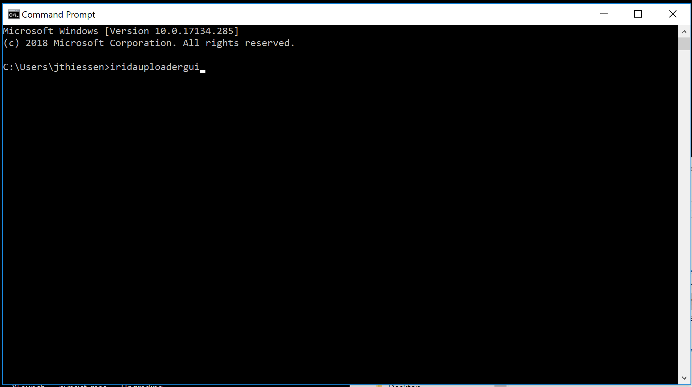

You will see a command line prompt.

Type in `iridauploadergui` and press `Enter` to launch the application

#### Configure your Uploader


Now that the uploader is open, click the `Configure Settings` button to open the config screen.

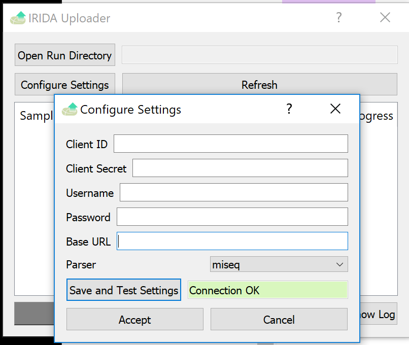

Fill these fields with the provided credentials.

#### Download data set

On this tutorial page, Click the `Clone or download` button and select `Download ZIP` to download the dataset.

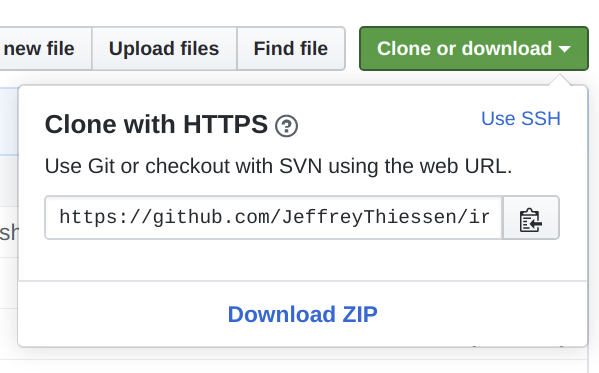

Unzip the data and locate the folder called `example_miseq_data`, this is sequencing run we are going to upload.

#### Edit your SampleSheet.csv file in the dataset

In the `example_miseq_data` directory, locate the file named `SampleSheet.csv`. This file is responsible for listing the sample files and what project they are going to be uploaded to.


Open the Sample Sheet file and find the empty `Sample_Project` column under the `[Data]` header. Edit this column such that every sample has the project number for the IRIDA project we created earlier.

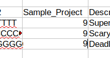

In this case, our project number was 9. After editing the file make sure to save.

Make sure you keep the CSV file format if edit the file with Microsoft Excel or other spreadsheet software.


#### Upload data

Return to the IRIDA Uploader program, and select the `Open Run Directory` button.

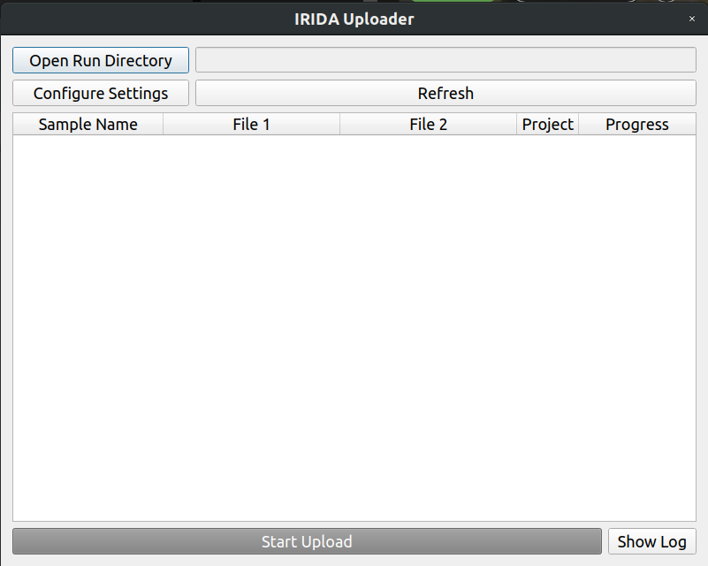

Find and select the `example_miseq_data` directory again, and click `Open` while the directory is selected.

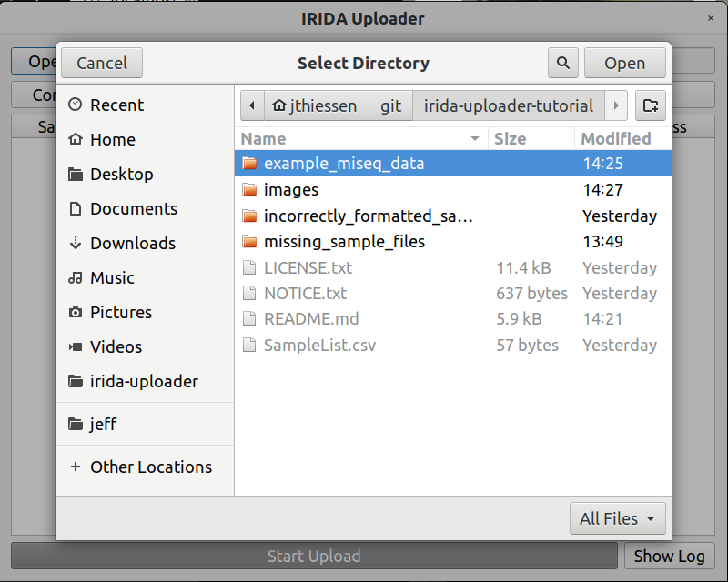

The uploader should now look like this. You can now click upload to start uploading.

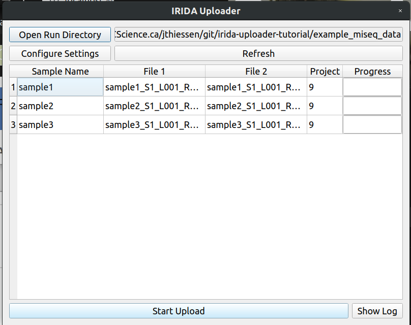

Congratulations! You have successfully uploaded the sequencing run. You can also click the `Show Log` button for more information about your upload.

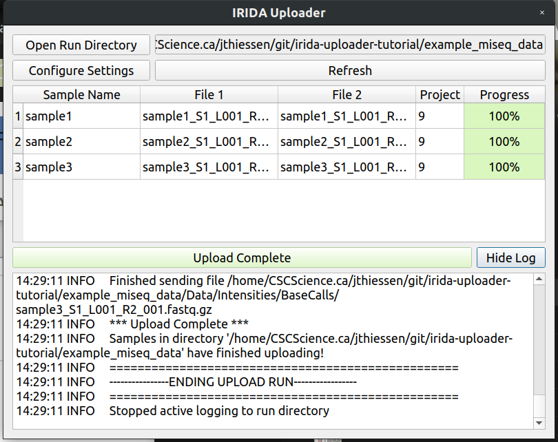

Now that the run has been uploaded, two new files have been created in your sequencing run directory.

`irida_uploader_status.info`: This contains useful reference information about your run. Please open this file and try to become familiar with it.

It contains the following fields:
* Date Time: The time of the upload.
* IRIDA Instance: The URL of the IRIDA instance the data was uploaded to.
* Message: If an error occurs while uploading, it appears here.
* Run ID: The upload run number, this number can be used to reference the run if data needs to be deleted by an administrator
* Upload Status: Indicates if the run was completed successfully, partially, or if an error occured

`irida-uploader.log`: This contains a history of everything the uploaded did while uploading. This can be useful when solving problems that could occur when uploading.

#### Verify data is in your IRIDA project

Refresh the page for your IRIDA project and see that your data now exists.

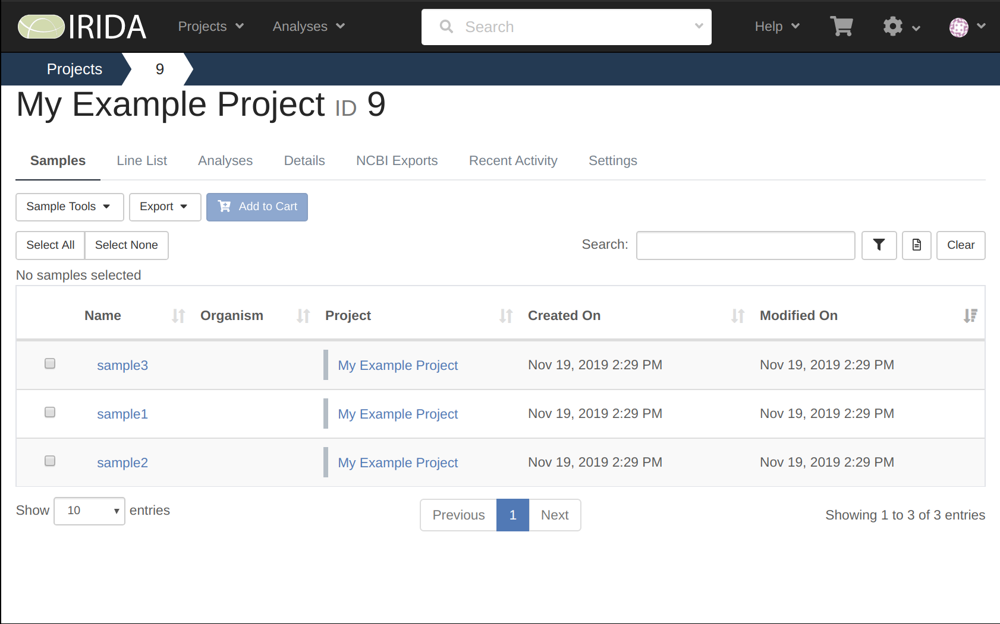

## Uploading non-Illumina data

#### File Structure
For simplicity, please keep the data you would like to upload all in one directory

#### Create a SampleList.csv file
Copy the `SampleList.csv` File from this tutorial into the directory where your data is. It will contain the following lines.

[SampleList.csv](../master/SampleList.csv)

```
[Data]
Sample_Name,Project_ID,File_Forward,File_Reverse
```

Add the following information to the `SampleList.csv` file for each sample you wish to upload.

* Sample_Name : This is what the sample will be identified as on IRIDA after upload.

* Project_ID: The IRIDA project the sample will be uploaded to.

* File_Forward: Always needed, the forward read file.

* File_Reverse: Needed for paired end reads, the reverse read file.

__Note__ : All samples in an upload must be either Paired or Single end reads. You __cannot__ mix single and paired end data in a single upload.

When uploading paired end reads, your file names must indicate forward/reverse.

Use the same name between files, with the difference of including `1` / `2`, `F` / `R`, `f` / `r`, as shown below.

__Example SampleList.csv__

```
[Data]
Sample_Name,Project_ID,File_Forward,File_Reverse
my-sample-1,75,file_1.fastq.gz,file_2.fastq.gz
my-sample-2,75,samp_F.fastq.gz,samp_R.fastq.gz
my-sample-3,76,germ_f.fastq.gz,germ_r.fastq.gz
```

Make sure you keep the CSV file format if edit the file with Microsoft Excel or other spreadsheet software.


#### Set IRIDA Uploader to Directory Parser
In the configuration screen of the IRIDA Uploader, change the parser field to `directory`


Now when opening the directory with your SampleList.csv file and data, you data will be shown in the Uploader.


#### More...
You can see more indepth information on uploading your own data in the Documention: https://irida-uploader.readthedocs.io/en/stable/parsers/directory.html

## Common Errors

### Incorrectly formatted Sample Sheet

The sequencing run we are using for this tutorial is also included in this github repository under the directory name `incorrectly_formatted_sample_sheet`.

If you try to open a directory with a broken sample sheet file, the uploader will show you an error like this

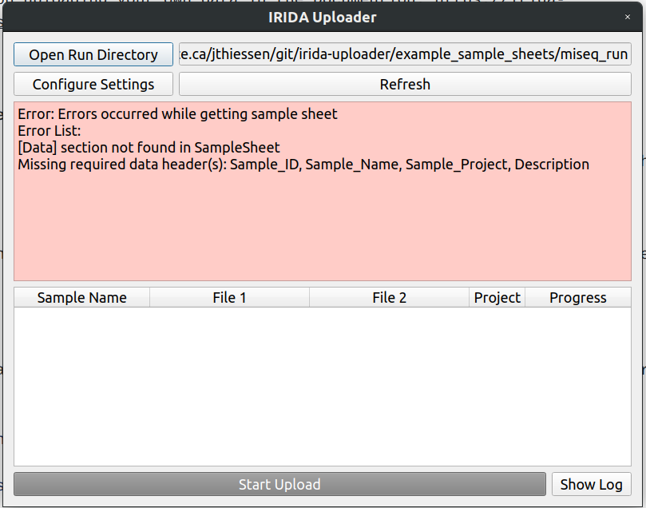

From reading the error message, we can see that the `[Data]` header that we expected is not there. Lets open the Sample Sheet file to take a closer look.

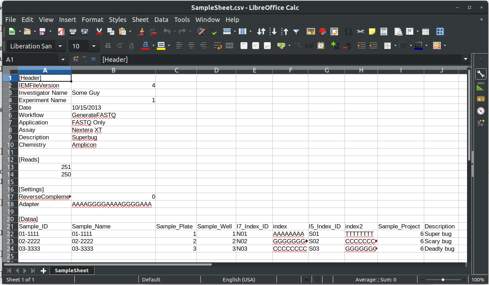

It looks like `[Data]` somehow got changed to `[Dataa]`, lets change it back, save the file, and click refresh in the uploader.

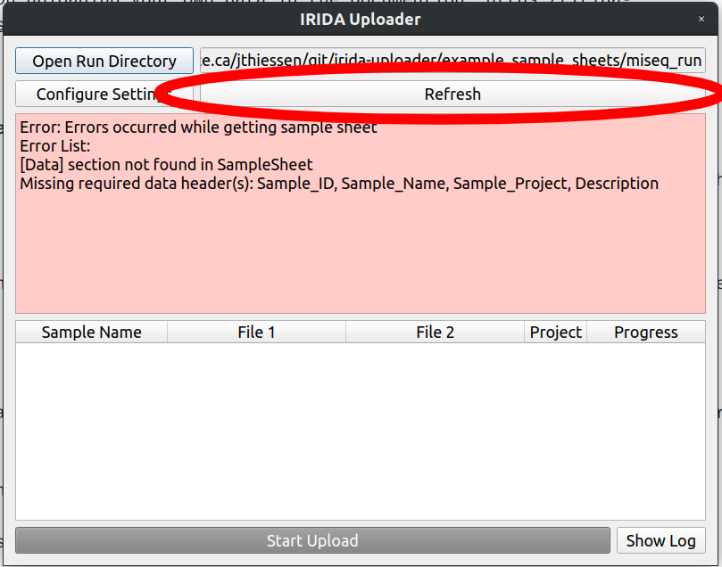

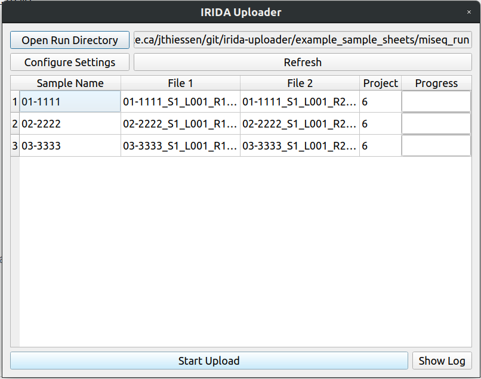

Now everything looks good to go.

### Missing or incorrectly named sample files

If a sample file gets renamed, or the sample sheet is edited, the sample sheet may throw an error.

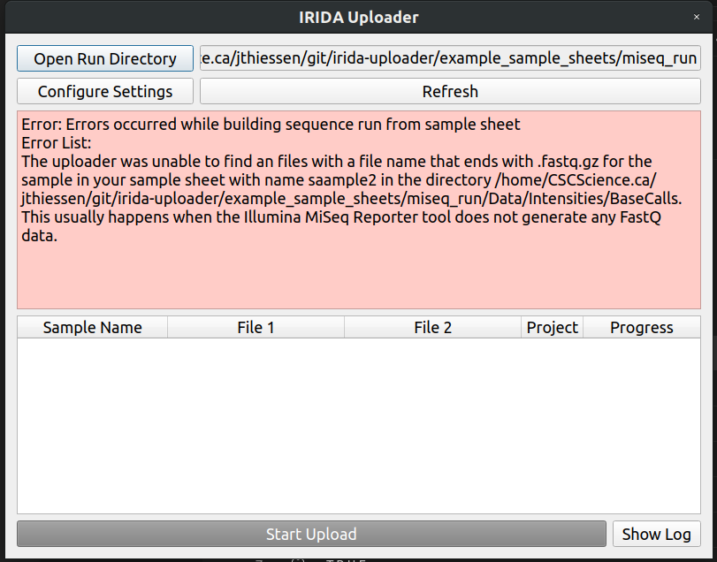

Let's take a look at the sample sheet and file directory

The sample sheet file is called `SampleSheet.csv` for our Miseq run:


The Miseq data is found in the `Data\Intensities\Basecalls` directory:


It looks like our second sample `sample2_S1_L001_R1_001.fastq.gz` accidentally got renamed to `saample2` in our `SampleSheet.csv` file.

Lets change it to `sample2`, save the file, and click the refresh button in the IRIDA Uploader

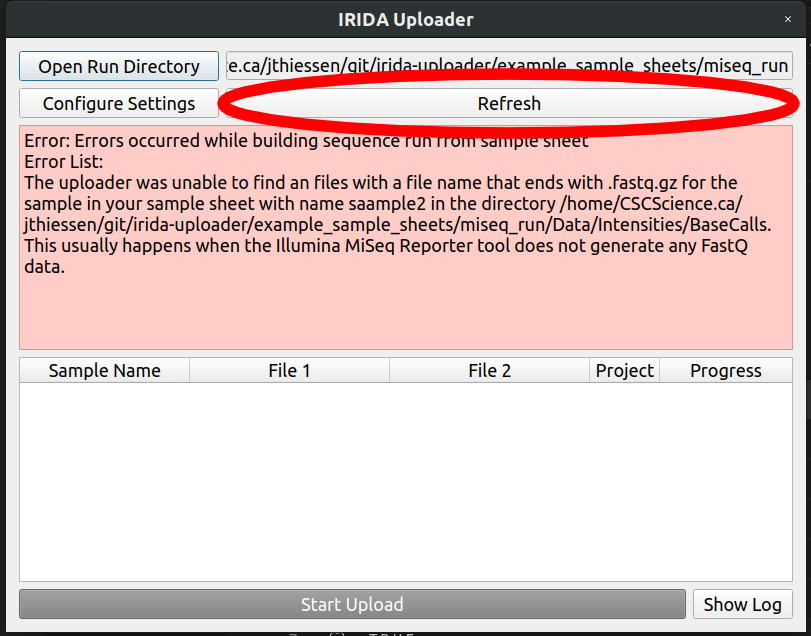

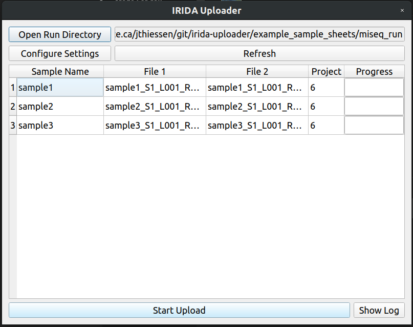

Now everything looks good to go.

__Note__: Other sequencers have their files in different locations, please refer to our `Parsers` documentation for more information

* Miseq: https://irida-uploader.readthedocs.io/en/stable/parsers/miseq.html
* Miniseq: https://irida-uploader.readthedocs.io/en/stable/parsers/miniseq.html
* Nextseq / Iseq: https://irida-uploader.readthedocs.io/en/stable/parsers/nextseq.html

### Partially uploaded run
Sometimes while uploaded, the unexpected can occur and cause the upload to stop.

In this case some of your data is likely uploaded. To save time we can edit our sample sheet to include only the files that still need to be uploaded.

As with any error or unexpected behaviour, the first thing you should do is take a look at the `irida_uploader_status.info` file in the run directory.

```
{
    "Date Time": "2019-11-29 12:08",
    "Message": null,
    "Upload Status": "partial"
}
```

As we can see, the status of the run is partial, meaning it is likely that some data uploaded before the error occured.

Lets take a look at the irida-uploader.log file in the same directory to try to get a clearer picture.

```
...
2019-11-29 12:08:26 INFO     Validating sequencing run
2019-11-29 12:08:26 INFO     *** Parsing Done ***
2019-11-29 12:08:26 INFO     *** Connecting to IRIDA ***
2019-11-29 12:08:26 INFO     *** Connected ***
2019-11-29 12:08:26 INFO     *** Verifying run (online validation) ***
2019-11-29 12:08:26 INFO     Loading projects.
2019-11-29 12:08:26 INFO     Getting samples from project '6'
2019-11-29 12:08:26 INFO     Getting samples from project '6'
2019-11-29 12:08:26 INFO     Getting samples from project '6'
2019-11-29 12:08:26 INFO     *** Run Verified ***
2019-11-29 12:08:26 INFO     *** Starting Upload ***
2019-11-29 12:08:27 INFO     Sequencing run id '19' has been created for upload
2019-11-29 12:08:27 INFO     Uploading to Sample 01-1111 on Project 6
2019-11-29 12:08:28 INFO     Starting to send file /miseq_run/Data/Intensities/BaseCalls/01-1111_S1_L001_R1_001.fastq.gz
2019-11-29 12:08:28 INFO     Finished sending file /miseq_run/Data/Intensities/BaseCalls/01-1111_S1_L001_R1_001.fastq.gz
2019-11-29 12:08:28 INFO     Starting to send file /miseq_run/Data/Intensities/BaseCalls/01-1111_S1_L001_R2_001.fastq.gz
2019-11-29 12:08:28 INFO     Finished sending file /miseq_run/Data/Intensities/BaseCalls/01-1111_S1_L001_R2_001.fastq.gz
2019-11-29 12:08:28 INFO     Uploading to Sample 02-2222 on Project 6
```

We can see here that the sample named 01-1111 finished uploading, and the sample named 02-2222 was started but did not complete, and our sampled named 03-3333 never started.

Lets confirm this by taking a look at our samples on IRIDA.


Here we can see all 3 of our samples are on our project, but we need to look at them to see if the data is there.

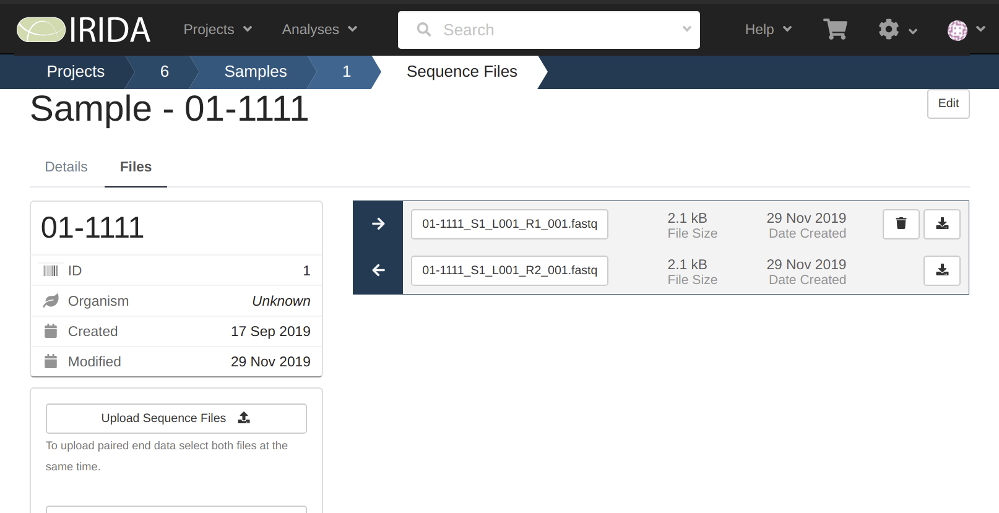

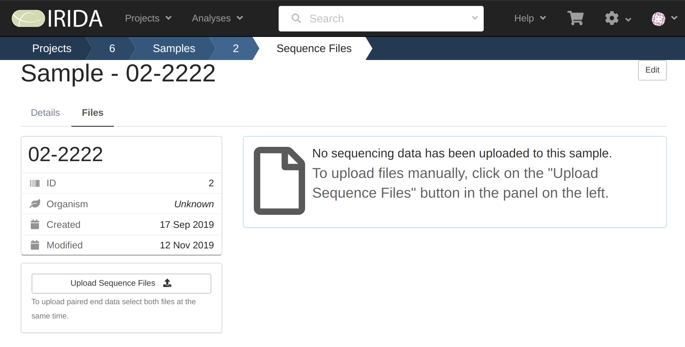


By looking at these we can see that only sample 01-1111 has the data uploaded to it.

Lets edit our sample sheet to match what data still needs to be uploaded.

First make a copy your sample sheet to make sure you have a backup of the original samplesheet for reference.

```
[Header]
IEMFileVersion,4
Investigator Name,Some Guy
Experiment Name,1
Date,10/15/2013
Workflow,GenerateFASTQ
Application,FASTQ Only
Assay,Nextera XT
Description,Superbug
Chemistry,Amplicon

[Reads]
251
250

[Settings]
ReverseComplement,0
Adapter,AAAAGGGGAAAAGGGGAAA

[Data]
Sample_ID,Sample_Name,Sample_Plate,Sample_Well,I7_Index_ID,index,I5_Index_ID,index2,Sample_Project,Description
01-1111,01-1111,1,01,N01,AAAAAAAA,S01,TTTTTTTT,6,Super bug 
02-2222,02-2222,2,02,N02,GGGGGGGG,S02,CCCCCCCC,6,Scary bug 
03-3333,03-3333,3,03,N03,CCCCCCCC,S03,GGGGGGGG,6,Deadly bug
```

Now edit your sample sheet to remove the sample rows that have already been uploaded

```
[Header]
IEMFileVersion,4
Investigator Name,Some Guy
Experiment Name,1
Date,10/15/2013
Workflow,GenerateFASTQ
Application,FASTQ Only
Assay,Nextera XT
Description,Superbug
Chemistry,Amplicon

[Reads]
251
250

[Settings]
ReverseComplement,0
Adapter,AAAAGGGGAAAAGGGGAAA

[Data]
Sample_ID,Sample_Name,Sample_Plate,Sample_Well,I7_Index_ID,index,I5_Index_ID,index2,Sample_Project,Description
02-2222,02-2222,2,02,N02,GGGGGGGG,S02,CCCCCCCC,6,Scary bug 
03-3333,03-3333,3,03,N03,CCCCCCCC,S03,GGGGGGGG,6,Deadly bug
```

Open the sample directory in the IRIDA Uploader again, and you will be greated with a warning that the run was partially uploaded, this is what we expected, so hit continue.

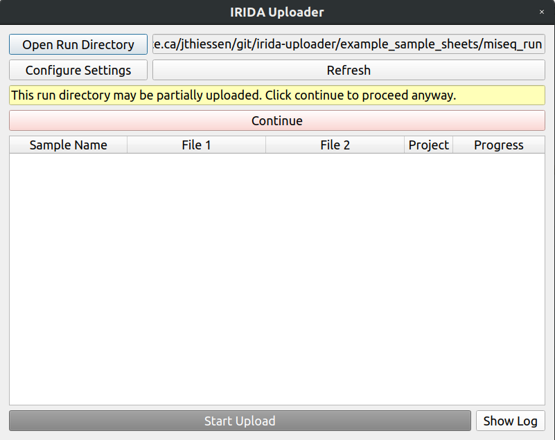

You can now upload the rest of your data.

### More Errors
Take a look through our documentation for more errors that could occur while trying to upload data: https://irida-uploader.readthedocs.io/en/stable/errors.html
